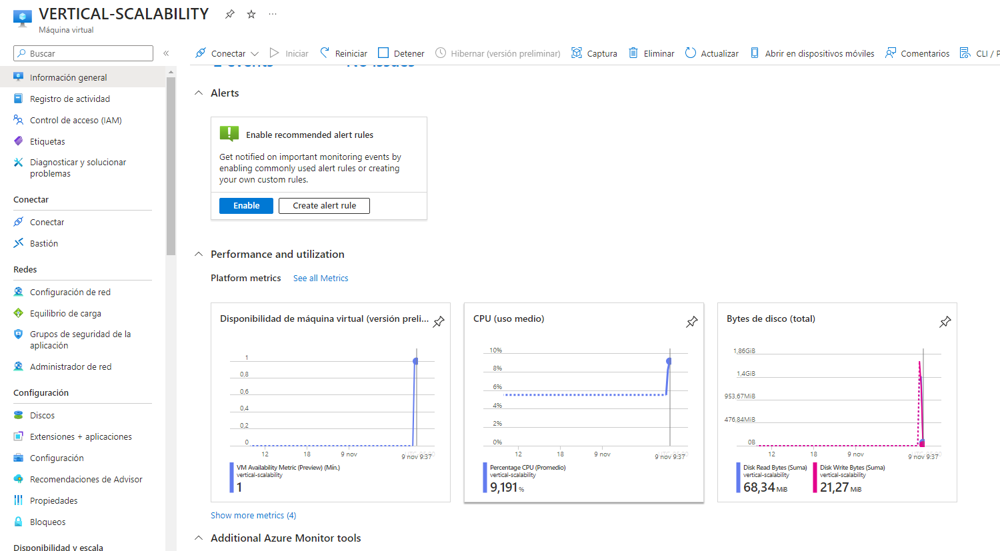
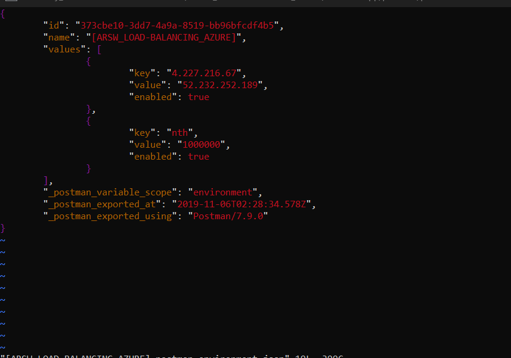
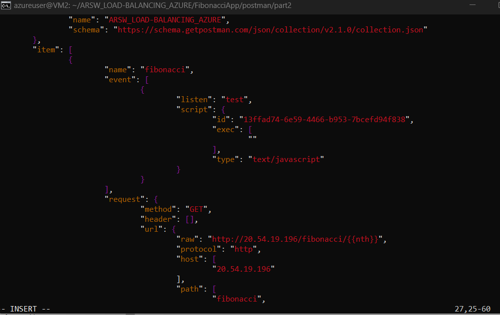

### Escuela Colombiana de Ingeniería
### Arquitecturas de Software - ARSW
### Realizado por Miguel Barrera y Jaider Gonzalez
#### Evidencias y Documentación en este README

## Escalamiento en Azure con Maquinas Virtuales, Sacale Sets y Service Plans

### Dependencias
* Cree una cuenta gratuita dentro de Azure. Para hacerlo puede guiarse de esta [documentación](https://azure.microsoft.com/es-es/free/students/). Al hacerlo usted contará con $100 USD para gastar durante 12 meses.

### Parte 0 - Entendiendo el escenario de calidad

Adjunto a este laboratorio usted podrá encontrar una aplicación totalmente desarrollada que tiene como objetivo calcular el enésimo valor de la secuencia de Fibonnaci.

**Escalabilidad**
Cuando un conjunto de usuarios consulta un enésimo número (superior a 1000000) de la secuencia de Fibonacci de forma concurrente y el sistema se encuentra bajo condiciones normales de operación, todas las peticiones deben ser respondidas y el consumo de CPU del sistema no puede superar el 70%.

### Parte 1 - Escalabilidad vertical

1. Diríjase a el [Portal de Azure](https://portal.azure.com/) y a continuación cree una maquina virtual con las características básicas descritas en la imágen 1 y que corresponden a las siguientes:
    * Resource Group = SCALABILITY_LAB
    * Virtual machine name = VERTICAL-SCALABILITY
    * Image = Ubuntu Server 
    * Size = Standard B1ls
    * Username = scalability_lab
    * SSH publi key = Su llave ssh publica

    

2. Para conectarse a la VM use el siguiente comando, donde las `x` las debe remplazar por la IP de su propia VM (Revise la sección "Connect" de la virtual machine creada para tener una guía más detallada).

    `ssh scalability_lab@xxx.xxx.xxx.xxx`

3. Instale node, para ello siga la sección *Installing Node.js and npm using NVM* que encontrará en este [enlace](https://linuxize.com/post/how-to-install-node-js-on-ubuntu-18.04/).
4. Para instalar la aplicación adjunta al Laboratorio, suba la carpeta `FibonacciApp` a un repositorio al cual tenga acceso y ejecute estos comandos dentro de la VM:

    `git clone <your_repo>`

    `cd <your_repo>/FibonacciApp`

    `npm install`

5. Para ejecutar la aplicación puede usar el comando `npm FibinacciApp.js`, sin embargo una vez pierda la conexión ssh la aplicación dejará de funcionar. Para evitar ese compartamiento usaremos *forever*. Ejecute los siguientes comando dentro de la VM.

    ` node FibonacciApp.js`

    **Ejecución de la aplicación:**

    

6. Antes de verificar si el endpoint funciona, en Azure vaya a la sección de *Networking* y cree una *Inbound port rule* tal como se muestra en la imágen. Para verificar que la aplicación funciona, use un browser y user el endpoint `http://xxx.xxx.xxx.xxx:3000/fibonacci/6`. La respuesta debe ser `The answer is 8`.

    

    **Configuración del puerto:**

    

    **Prueba de ejecución:**

    

7. La función que calcula en enésimo número de la secuencia de Fibonacci está muy mal construido y consume bastante CPU para obtener la respuesta. Usando la consola del Browser documente los tiempos de respuesta para dicho endpoint usando los siguintes valores:
    * 1000000

        

    * 1010000

        

    * 1020000
        
        

    * 1030000

        

    * 1040000

        

    * 1050000

        

    * 1060000

        

    * 1070000

        

    * 1080000

        

    * 1090000

            

8. Dírijase ahora a Azure y verifique el consumo de CPU para la VM. (Los resultados pueden tardar 5 minutos en aparecer).

    
    **Consumo de la CPU:**
    

    

9. Ahora usaremos Postman para simular una carga concurrente a nuestro sistema. Siga estos pasos.
    * Instale newman con el comando `npm install newman -g`. Para conocer más de Newman consulte el siguiente [enlace](https://learning.getpostman.com/docs/postman/collection-runs/command-line-integration-with-newman/).
    * Diríjase hasta la ruta `FibonacciApp/postman` en una maquina diferente a la VM.
    * Para el archivo `[ARSW_LOAD-BALANCING_AZURE].postman_environment.json` cambie el valor del parámetro `VM1` para que coincida con la IP de su VM.
    * Ejecute el siguiente comando.

    ```
    newman run ARSW_LOAD-BALANCING_AZURE.postman_collection.json -e [ARSW_LOAD-BALANCING_AZURE].postman_environment.json -n 10 &
    newman run ARSW_LOAD-BALANCING_AZURE.postman_collection.json -e [ARSW_LOAD-BALANCING_AZURE].postman_environment.json -n 10
    ```
    **Instalación:**
    
    

    

    **Se asigna la IP correspondiente a la VM:**
    

    

    **Prueba de Ejecución:**
    

    **Consumo de CPU:**

    

10. La cantidad de CPU consumida es bastante grande y un conjunto considerable de peticiones concurrentes pueden hacer fallar nuestro servicio. Para solucionarlo usaremos una estrategia de Escalamiento Vertical. En Azure diríjase a la sección *size* y a continuación seleccione el tamaño `B2ms`.

    
    
    **Cambio del tamaño de la VM:**
    
    

11. Una vez el cambio se vea reflejado, repita el paso 7, 8 y 9.
    
    **Repetición paso 7:**
    
    

    

    

    

    

    

    

    

    

    

    **Repetición paso 8:**

    

    **Repetición paso 9:**

    

12. Evalue el escenario de calidad asociado al requerimiento no funcional de escalabilidad y concluya si usando este modelo de escalabilidad logramos cumplirlo.


Dado que hubo una reducción en el tiempo de ejecución y una disminución en el uso de la CPU, podemos concluir que el modelo de escalabilidad ha tenido un impacto positivo en el cumplimiento del requerimiento no funcional de escalabilidad. Sin embargo, la presencia de solicitudes fallidas es un problema importante. Podría indicar que, aunque el sistema maneja mejor las cargas normales, puede estar alcanzando sus límites en situaciones de carga más alta, es algo que se ve reflejado en los picos de las gráficas de consumo de CPU. 

13. Vuelva a dejar la VM en el tamaño inicial para evitar cobros adicionales.

    

**Preguntas**

1. ¿Cuántos y cuáles recursos crea Azure junto con la VM?

    La creación de una máquina virtual (VM) en Microsoft Azure no solo implica la creación de la VM en sí, sino también de varios recursos asociados que son necesarios para el funcionamiento y la administración de la VM. Se crean 6 recursos:

    * Clave SSH

    * Dirección IP pública
    
    * Disco
    
    * Grupo de seguridad de red
    
    * Interfaz de red
    
    * Máquina virtual

2. ¿Brevemente describa para qué sirve cada recurso?
    
    * **Clave SSH:** La clave SSH se utiliza para autenticar y permitir el acceso seguro a la máquina virtual a través del protocolo SSH. Se utiliza en lugar de la autenticación basada en contraseña para una mayor seguridad.

    * **Dirección IP pública:** La dirección IP pública permite que la máquina virtual sea accesible desde Internet. Es la dirección a la que se pueden conectar servicios, aplicaciones o usuarios externos.
    
    * **Disco:** Un disco en Azure se utiliza para almacenar el sistema operativo, las aplicaciones y los datos de la máquina virtual. Puede haber discos para el sistema operativo (OS) y discos de datos adicionales.

    * **Grupo de seguridad de red:** Un grupo de seguridad de red (NSG) actúa como un cortafuegos virtual para controlar el tráfico de red hacia y desde una máquina virtual. Permite configurar reglas para permitir o denegar el tráfico según las necesidades de seguridad.

    * **Interfaz de red:** La interfaz de red está asociada a la máquina virtual y al grupo de seguridad de red. Facilita la comunicación de la máquina virtual con la red y ayuda a administrar las reglas de seguridad que se aplican a la máquina.

    * **Máquina virtual:** La máquina virtual en sí misma es el recurso principal. Representa la instancia de una computadora virtual que ejecuta un sistema operativo y puede ser configurada con recursos como CPU, memoria, almacenamiento, etc. para satisfacer los requisitos específicos de la aplicación.

3. ¿Al cerrar la conexión ssh con la VM, por qué se cae la aplicación que ejecutamos con el comando `npm FibonacciApp.js`? ¿Por qué debemos crear un *Inbound port rule* antes de acceder al servicio?

    La aplicación se cae al cerrar la conexión SSH porque el proceso en la VM está asociado a la sesión SSH activa. Cuando la conexión SSH se cierra, el proceso asociado también termina. La creación de una Inbound port rule es necesaria para permitir el tráfico al puerto específico (en este caso, el puerto 3000) en la VM. Sin esta regla, el tráfico no puede llegar al servicio que se ejecuta en la VM.

4. Adjunte tabla de tiempos e interprete por qué la función tarda tanto tiempo.

    **Tiempo base:**

    | Número de Fibonacci | Tiempo de Respuesta (segundos) | 
    | :------------: | :------------: |
    | 1000000    | 26.72   |
    | 1010000   | 26.79    | 
    | 1020000   | 27.74    |
    | 1030000    | 28.81    |
    | 1040000   | 28.66    | 
    | 1050000   | 29.02    |
    | 1060000    | 29.91    |
    | 1070000   | 30.92   | 
    | 1080000   | 31.97    |
    | 1090000    | 33   |
    
    **Tiempo tras estrategua de escalamiento vertical:**

    | Número de Fibonacci | Tiempo de Respuesta (segundos) | 
    | :------------: | :------------: |
    | 1000000    | 25.44   |
    | 1010000   | 26.36    | 
    | 1020000   | 27.32    |
    | 1030000    | 27.87    |
    | 1040000   | 28.24    | 
    | 1050000   | 28.46    |
    | 1060000    | 28.94    |
    | 1070000   | 29.63   | 
    | 1080000   | 30.81    |
    | 1090000    | 31.09   |

    Antes del escalamiento vertical, la función de Fibonacci tenía tiempos de respuesta más altos, indicando una carga de trabajo más pesada para la VM original (B1ls). Después de aplicar la estrategia de escalamiento vertical, al cambiar a una VM más grande (B2ms), se observa una mejora en los tiempos de respuesta. Esto sugiere que la VM con mayores recursos puede manejar la carga de trabajo de manera más eficiente, reduciendo el tiempo necesario para calcular los números de Fibonacci. Sin embargo, a pesar de la mejora, los tiempos de respuesta aún pueden considerarse altos debido a la naturaleza ineficiente de la implementación de la función de Fibonacci.
    
5. Adjunte imágen del consumo de CPU de la VM e interprete por qué la función consume esa cantidad de CPU.
    
    **Consumo de CPU base:**

    

    **Consumo de CPU tras estrategia de escalamiento vertical:**

    

    La imagen muestra el consumo de CPU de la VM. Se observa que, después de cambiar el tamaño de la VM a B2ms, hay una mejora en el consumo de CPU en comparación con el tamaño original B1ls. La función de FibonacciApp consume menos recursos de CPU, lo que indica una mejor capacidad de la VM para manejar la carga de trabajo.

    La mejora en el consumo de CPU se debe a que B2ms proporciona más recursos de CPU y memoria en comparación con B1ls. Esto permite que la aplicación maneje las solicitudes concurrentes de manera más eficiente y reduce la presión sobre los recursos de la VM. En consecuencia, se logra una distribución más equitativa de la carga y se mejora el rendimiento general de la aplicación.

6. Adjunte la imagen del resumen de la ejecución de Postman. Interprete:
    * Tiempos de ejecución de cada petición.

        Los tiempos de ejecución varían, pero en general son altos debido a la ineficiencia de la función de Fibonacci. La aplicación no escala bien bajo carga concurrente, como se evidencia en los tiempos de respuesta.

    * Si hubo fallos documentelos y explique.
        
        Sí, hubo solicitudes fallidas. Esto puede deberse a que la carga concurrente excede la capacidad de la VM, causando tiempos de espera y posiblemente errores en algunas solicitudes.

7. ¿Cuál es la diferencia entre los tamaños `B2ms` y `B1ls` (no solo busque especificaciones de infraestructura)?

    La diferencia no solo radica en las especificaciones de infraestructura, sino también en el rendimiento y la capacidad de procesamiento. El tamaño B2ms es superior en términos de recursos de CPU y memoria en comparación con B1ls. A menudo, cambiar a un tamaño de VM más grande implica un mayor rendimiento, pero también puede tener un costo adicional.

8. ¿Aumentar el tamaño de la VM es una buena solución en este escenario?, ¿Qué pasa con la FibonacciApp cuando cambiamos el tamaño de la VM?

    Aumentar el tamaño de la VM puede ser una solución para mejorar el rendimiento en términos de capacidad de procesamiento y memoria. Sin embargo, en este escenario específico, la función de FibonacciApp aún es ineficiente y puede no escalar de manera óptima, incluso con un tamaño de VM más grande. Cambiar el tamaño de la VM puede mejorar el rendimiento, pero no aborda la raíz del problema, que es la ineficiencia en la implementación de la función.

9. ¿Qué pasa con la infraestructura cuando cambia el tamaño de la VM? ¿Qué efectos negativos implica?

    Cambiar el tamaño de la VM implica detener y reiniciar la VM con la nueva configuración. Esto puede resultar en un tiempo de inactividad temporal para la aplicación. Además, un tamaño de VM más grande puede implicar costos adicionales, ya que se le facturará según la capacidad de la VM. El aumento en los recursos de la VM puede mejorar el rendimiento, pero es esencial evaluar y equilibrar los costos y beneficios.

10. ¿Hubo mejora en el consumo de CPU o en los tiempos de respuesta? Si/No ¿Por qué?

    Sí, hubo una mejora en el consumo de CPU y los tiempos de respuesta después de cambiar el tamaño de la VM a B2ms. Esto se debe a que B2ms proporciona más recursos de CPU y memoria, lo que permite manejar mejor la carga de trabajo. Sin embargo, la mejora podría no ser suficiente para manejar cargas más grandes o mejorar significativamente la eficiencia de la función de Fibonacci.

11. Aumente la cantidad de ejecuciones paralelas del comando de postman a `4`. ¿El comportamiento del sistema es porcentualmente mejor?

    el aumento en la cantidad de ejecuciones paralelas pone más presión en el sistema y revela aún más las limitaciones de la implementación actual de la función de Fibonacci y la capacidad de la VM. Se experimenta un mayor consumo de CPU y más solicitudes fallidas bajo estas cargas más altas.

### Parte 2 - Escalabilidad horizontal

#### Crear el Balanceador de Carga

Antes de continuar puede eliminar el grupo de recursos anterior para evitar gastos adicionales y realizar la actividad en un grupo de recursos totalmente limpio.

1. El Balanceador de Carga es un recurso fundamental para habilitar la escalabilidad horizontal de nuestro sistema, por eso en este paso cree un balanceador de carga dentro de Azure tal cual como se muestra en la imágen adjunta.


2. A continuación cree un *Backend Pool*, guiese con la siguiente imágen.


3. A continuación cree un *Health Probe*, guiese con la siguiente imágen.


4. A continuación cree un *Load Balancing Rule*, guiese con la siguiente imágen.


5. Cree una *Virtual Network* dentro del grupo de recursos, guiese con la siguiente imágen.


#### Crear las maquinas virtuales (Nodos)

Ahora vamos a crear 3 VMs (VM1, VM2 y VM3) con direcciones IP públicas standar en 3 diferentes zonas de disponibilidad. Después las agregaremos al balanceador de carga.

1. En la configuración básica de la VM guíese por la siguiente imágen. Es importante que se fije en la "Avaiability Zone", donde la VM1 será 1, la VM2 será 2 y la VM3 será 3.


2. En la configuración de networking, verifique que se ha seleccionado la *Virtual Network*  y la *Subnet* creadas anteriormente. Adicionalmente asigne una IP pública y no olvide habilitar la redundancia de zona.


3. Para el Network Security Group seleccione "avanzado" y realice la siguiente configuración. No olvide crear un *Inbound Rule*, en el cual habilite el tráfico por el puerto 3000. Cuando cree la VM2 y la VM3, no necesita volver a crear el *Network Security Group*, sino que puede seleccionar el anteriormente creado.


4. Ahora asignaremos esta VM a nuestro balanceador de carga, para ello siga la configuración de la siguiente imágen.


5. Finalmente debemos instalar la aplicación de Fibonacci en la VM. para ello puede ejecutar el conjunto de los siguientes comandos, cambiando el nombre de la VM por el correcto

```
git clone https://github.com/daprieto1/ARSW_LOAD-BALANCING_AZURE.git

curl -o- https://raw.githubusercontent.com/creationix/nvm/v0.34.0/install.sh | bash
source /home/vm1/.bashrc
nvm install node

cd ARSW_LOAD-BALANCING_AZURE/FibonacciApp
npm install

npm install forever -g
forever start FibonacciApp.js
```

Realice este proceso para las 3 VMs, por ahora lo haremos a mano una por una, sin embargo es importante que usted sepa que existen herramientas para aumatizar este proceso, entre ellas encontramos Azure Resource Manager, OsDisk Images, Terraform con Vagrant y Paker, Puppet, Ansible entre otras.


#### Probar el resultado final de nuestra infraestructura

1. Porsupuesto el endpoint de acceso a nuestro sistema será la IP pública del balanceador de carga, primero verifiquemos que los servicios básicos están funcionando, consuma los siguientes recursos:

```
http://52.155.223.248/
http://52.155.223.248/fibonacci/1
```


2. Realice las pruebas de carga con `newman` que se realizaron en la parte 1 y haga un informe comparativo donde contraste: tiempos de respuesta, cantidad de peticiones respondidas con éxito, costos de las 2 infraestrucruras, es decir, la que desarrollamos con balanceo de carga horizontal y la que se hizo con una maquina virtual escalada.




**Máquina virtual VM1:** 


**Máquina virtual VM2:**


3. Agregue una 4 maquina virtual y realice las pruebas de newman, pero esta vez no lance 2 peticiones en paralelo, sino que incrementelo a 4. Haga un informe donde presente el comportamiento de la CPU de las 4 VM y explique porque la tasa de éxito de las peticiones aumento con este estilo de escalabilidad.

```
newman run ARSW_LOAD-BALANCING_AZURE.postman_collection.json -e [ARSW_LOAD-BALANCING_AZURE].postman_environment.json -n 10 &
newman run ARSW_LOAD-BALANCING_AZURE.postman_collection.json -e [ARSW_LOAD-BALANCING_AZURE].postman_environment.json -n 10 &
newman run ARSW_LOAD-BALANCING_AZURE.postman_collection.json -e [ARSW_LOAD-BALANCING_AZURE].postman_environment.json -n 10 &
newman run ARSW_LOAD-BALANCING_AZURE.postman_collection.json -e [ARSW_LOAD-BALANCING_AZURE].postman_environment.json -n 10
```


**Preguntas**

* ¿Cuáles son los tipos de balanceadores de carga en Azure y en qué se diferencian?, ¿Qué es SKU, qué tipos hay y en qué se diferencian?, ¿Por qué el balanceador de carga necesita una IP pública?
* ¿Cuál es el propósito del *Backend Pool*?
* ¿Cuál es el propósito del *Health Probe*?
* ¿Cuál es el propósito de la *Load Balancing Rule*? ¿Qué tipos de sesión persistente existen, por qué esto es importante y cómo puede afectar la escalabilidad del sistema?.
* ¿Qué es una *Virtual Network*? ¿Qué es una *Subnet*? ¿Para qué sirven los *address space* y *address range*?
* ¿Qué son las *Availability Zone* y por qué seleccionamos 3 diferentes zonas?. ¿Qué significa que una IP sea *zone-redundant*?
* ¿Cuál es el propósito del *Network Security Group*?
* Informe de newman 1 (Punto 2)
* Presente el Diagrama de Despliegue de la solución.


